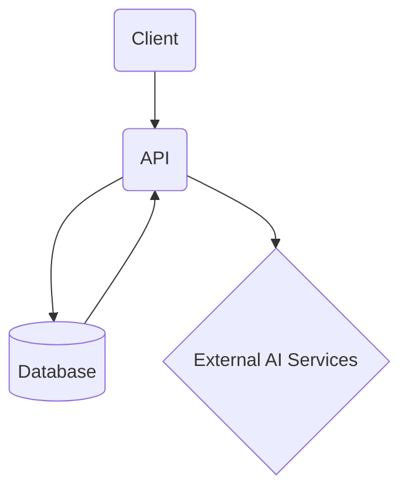

# RouteIQ

*AI model router that cuts your team's token bill by 70%, automatically.*

RouteIQ is an enterprise AI gateway that sits between a company's internal tools and frontier AI APIs (Claude, GPT-4o, Gemini). It intelligently routes each request to the cheapest capable model using a fine-tuned on-device classifier to assess task complexity in under 10ms before the request ever leaves the device. RouteIQ learns from each team's actual usage patterns, building a company-specific routing policy that can reduce frontier model calls by 60-80% while maintaining output quality, validated by a continuous A/B eval loop.

## Features

- **OpenAI-Compatible Proxy Endpoint**: Easily integrate by changing a single line of code (`base_url`).
- **On-Device Task Complexity Classifier**: Utilizes a fine-tuned DistilBERT model, deployed with ONNX, for sub-10ms prompt scoring.
- **Local, Mid-Tier, and Frontier Model Routing**: Routes requests intelligently to local models (Llama 3.1 8B), mid-tier models (Claude Haiku / GPT-4o-mini), or frontier models.
- **Cost Savings Insights**: Real-time dashboard showing token savings and model usage statistics.
- **Continuous A/B Evaluation**: Ensures output quality while optimizing costs.

## Tech Stack

- **Frontend**: React (Next.js) 13, Redux 8, Tailwind CSS 3, Chart.js 3
- **Backend**: FastAPI 0.95, Celery 5, ONNX Runtime 1.13, Redis 6
- **Database**: PostgreSQL 14, Redis 6 (caching)
- **Infrastructure**: Fly.io, Docker 24, Kubernetes 1.28, GitHub Actions
- **Mobile**: React Native 0.72, Swift 5
- **Payments**: Stripe API (latest)

## Architecture

RouteIQ's architecture is designed to optimize AI model usage efficiently. The system is composed of a client-side application, an API backend, a database, and connections to external AI services.



## Project Structure

```plaintext
RouteIQ/
├── backend/
│   ├── app/
│   │   ├── main.py
│   │   ├── routes/
│   │   │   ├── api.py
│   │   │   ├── auth.py
│   │   ├── models/
│   │   │   ├── user.py
│   │   │   ├── request.py
│   │   ├── services/
│   │   │   ├── routing.py
│   │   │   ├── classifier.py
│   │   ├── utils/
│   │   │   ├── logger.py
│   │   │   ├── redis_client.py
│   ├── celery_tasks/
│   │   ├── evaluator.py
│   │   ├── billing.py
├── frontend/
│   ├── pages/
│   │   ├── index.js
│   │   ├── dashboard.js
│   ├── components/
│   │   ├── Navbar.js
│   │   ├── Chart.js
│   ├── store/
│   │   ├── index.js
│   │   ├── reducers/
│   │   ├── actions/
│   ├── styles/
│       ├── global.css
├── mobile/
│   ├── App.js
│   ├── screens/
│   │   ├── HomeScreen.js
├── infra/
│   ├── Dockerfile
│   ├── docker-compose.yml
│   ├── k8s/
│       ├── deployment.yaml
│       ├── service.yaml
├── scripts/
│   ├── deploy.sh
│   ├── setup_db.py
├── docs/
│   ├── PRD.md
│   ├── DESIGN.md
│   ├── ARCHITECTURE.md
├── requirements.txt
├── frontend/package.json
├── mobile/package.json
├── .env.example
```

## Getting Started

### Prerequisites

- Node.js and npm
- Python 3.8+
- Docker
- Redis

### Installation

1. Clone the repository:

   ```bash
   git clone https://github.com/yourusername/RouteIQ.git
   cd RouteIQ
   ```

2. Install backend dependencies:

   ```bash
   pip install -r requirements.txt
   ```

3. Install frontend dependencies:

   ```bash
   cd frontend
   npm install
   ```

4. Install mobile dependencies:

   ```bash
   cd ../mobile
   npm install
   ```

### Environment Variables

Copy the `.env.example` file to `.env` and fill out the required environment variables:

```bash
cp .env.example .env
```

### Running

1. Start the backend server:

   ```bash
   cd backend
   uvicorn app.main:app --reload
   ```

2. Start the frontend server:

   ```bash
   cd frontend
   npm run dev
   ```

3. Start the mobile app:

   ```bash
   cd mobile
   npm start
   ```

4. Start Docker containers for Redis and other services:

   ```bash
   docker-compose up
   ```

## Documentation

- [Product Requirements](docs/PRD.md)
- [Design Brief](docs/DESIGN.md)
- [Architecture](docs/ARCHITECTURE.md)

## License

This project is licensed under the MIT License.